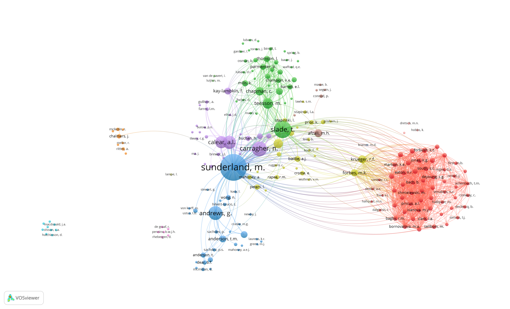

\newcounter{bib}

```{r setup, include=FALSE}
knitr::opts_chunk$set(echo = FALSE, warning = FALSE, message = FALSE)
library(vitae)
library(tidyverse)
library(scales)
library(rstudioapi)
pubs<- bibliography_entries("scopus.bib")
grants<-read_csv("grants.csv")
presos<-read_csv("presos.csv")
students<-read_csv("students.csv")
measures<-read_csv("measures.csv")
source("functions.R")
```

# Profile
\
I am a Senior Research Fellow and Program Lead of Measurement and Methodology at the Matilda Centre for Research in Mental Health and Substance Use, the University of Sydney. I lead an internationally recognised program of research that utilises innovative statistical and psychometric methods to answer important epidemiological questions on the relationship between mental health and substance use. I am a strong believer in open science and ensuring my work is transparent and of a high ethical standard. I am passionate about building capacity in the use of innovative quantitative methods in psychiatric research and effectively disseminating and translating my work into policy and practice. 
\
\

# Education

```{r}
library(tibble)
tribble(
  ~ Degree, ~ Year, ~ Institution,
  "Ph.D", "Conferred 2011", "School of Psychiatry, UNSW Sydney",
  "B Psychology (Hons)  /  Class 1", "Conferred 2007", "Department of Psychology, Macquarie University", 
) %>% 
  detailed_entries(Degree, Year, Institution)
```

# Current appointments

```{r, results='asis'}
tribble(
  ~Start, ~End, ~Position, ~Where,
  2018, NA, "Senior Research Fellow", "The Matilda Centre, University of Sydney",
  2020, NA, "Honorary Senior Research Fellow", "School of Psychology, Macquarie University",
  2017, NA, "Visiting Research Fellow", "Centre for Mental Health Research, Australian National University",
) %>%
  arrange(-Start) %>%
  mutate(End = replace_na(End, "Present")) %>%
  mutate(Years = if_else(End == Start,
        as.character(Start),
        paste(Start, "--", End, sep = ""),
        paste(Start, "--", End, sep = ""))) %>%
  select(Years, Position, Where) %>% 
  detailed_entries(
     Position, Years, Where
  ) 
```

# Previous appointments

```{r, results='asis'}
tribble(
  ~Start, ~End, ~Position, ~Where,
  2016, 2018, "Senior Research Fellow", "National Drug and Alcohol Research Centre, UNSW Sydney",
  2013, 2016, "NHMRC Early Career Research Fellow", "National Drug and Alcohol Research Centre, UNSW Sydney",
  2016, 2020, "External Research Fellow", "The Black Dog Institute, UNSW Sydney",
  2012, 2013, "Post-doctoral Research Fellow", "National Drug and Alcohol Research Centre, UNSW Sydney",
  2011, 2012, "Post-doctoral Research Fellow", "Clinical Research Unit for Anxiety and Depression, UNSW Sydney",
  2008, 2010, "Statistical Consultant","Clinical Research Unit for Anxiety and Depression, UNSW Sydney",
  2007, 2008, "Research Associate", "Clinical Research Unit for Anxiety and Depression, UNSW Sydney"
) %>%
  arrange(-Start) %>%
  mutate(End = replace_na(End, "Present")) %>%
  mutate(Years = if_else(End == Start,
        as.character(Start),
        paste(Start, "--", End, sep = ""),
        paste(Start, "--", End, sep = ""))) %>%
  select(Years, Position, Where) %>% 
  detailed_entries(
     Position, Years, Where
  ) 
```

# Academic and research leadership roles

```{r, results='asis'}
tribble(
  ~Start, ~End, ~Position, ~Where,
  2018, NA, "Program Lead in Mesurement and Methdology", "The Matilda Centre, University of Sydney",
  2011, 2012, "Co-research Director", "Clinical Research Unit for Anxiety and Depression, UNSW Sydney",
  2019, NA, "Lead, The Statistics Portfolio","The Matilda Centre, University of Sydney",
  2019, 2021, "Lead, Seminar and Training Committee", "The Matilda Centre, University of Sydney",
  2016, NA, "Lead, Mental Health Metrics Alliance", "University of Sydney"
) %>%
  arrange(-Start) %>%
  mutate(End = replace_na(End, "Present")) %>%
  mutate(Years = if_else(End == Start,
        as.character(Start),
        paste(Start, "--", End, sep = ""),
        paste(Start, "--", End, sep = ""))) %>%
  select(Years, Position, Where) %>% 
  detailed_entries(
     Position, Years, Where
  ) 
```

# Awards and honours

```{r}
tribble(
  ~Year, ~Award,
  2021, "The Matilda Centre Outstanding Contribution Award",
  2017, "Society for Mental Health Research Rising Star Award",
  2011, "UNSW Faculty of Medicine Dean's Rising Star Award"
) %>%
    detailed_entries(
     Award, Year
  ) 

```

\newpage 

# Research 
\
I have authored \textbf{`r NROW(pubs)`} scientific journal articles, book chapters, and technical reports. A full list of publications is provided on pages \pageref{pubstart}--\pageref{pubend}. I have developed or co-developed \textbf{`r NROW(measures)`} scales or assessment tools to measure mental health and substance use disorders on pages \pageref{meastart}--\pageref{meaend}.  
\
\
My current work addresses three key themes: 
\begin{enumerate}
\item \label{itm:first}Re-conceptualising the classification of mental health and substance use disorders.
\item \label{itm:second}Targeting inefficiencies in large-scale data collection and assessment.
\item \label{itm:third}Utilising innovative statistical procedures to generate new epidemiological evidence to inform prevention and early intervention efforts.
\end{enumerate}

# Publication Metrics

\begin{minipage}[t]{.5\linewidth}
  \begin{itemize}
    \item Journal Articles: `r sum(pubs$type=='article-journal')`
    \item Book Chapters: `r sum(pubs$type=='chapter')`
    \item Reports: `r sum(pubs$type=='report')`
    \item Consumer/Clinician instruments: 75
    \item I have published with 196 co-authors (see Figure 1)
  \end{itemize}
\end{minipage}
\begin{minipage}[t]{.5\linewidth}
  \begin{itemize}
    \item Citations: 4169
    \item H-index: 32
    \item Field Weighted Citation Index: 2.05
    \item Articles in top 10\% most cited worldwide: 21\%
  \end{itemize}
\end{minipage}
\



# Presentations

I have personally presented \textbf{`r NROW(presos)`} conferences presentations or invited seminars/workshops (see Table below). I have also co-authored >30 international and national presentations that were delivered by other co-authors (details not provided here). 
```{r}
presos%>%
  mutate(Conference=paste(Name, " ", Title, " ",
                  sep=""),
         Locate=paste(Location, ". ", Notes,".", sep="")) %>%
  select(Date, Conference, Locate) %>%
  detailed_entries(what=Conference, where=Locate, when=Date)

```


# Research funding
```{r grants}
sumgrants <- grants %>%
  pull(Amount) %>%
  sum(na.rm=TRUE)
```
I have successfully obtained approximately $`r sprintf("%2.1f", sumgrants/1e6)` million in external research funds as Chief Investigator or Associate Investigator. The majority of my research funds have been acquired since my previous promotion in 2016 as can be seen in the below table.

```{r}
grants%>%
  arrange(-Start, desc(Amount)) %>%
 mutate(Years = if_else(End == Start,
        as.character(Start),
        paste(Start, "--", End, sep = ""),
        paste(Start, "--", End, sep = "")),
        Amount=dollar(Amount),
        Title=paste(Title, ". ",
                  "Funding from ", Source, ".",
                  sep=""))%>%
  select(Years, Title, Role, Amount) %>%
  detailed_entries(Title, Years, Role, Amount)

```


# Research instruments

\label{meastart}
```{r}
measures%>%
 mutate(Type=paste(Instrument, ": ", Type, " for ", Disorder, ".", 
                   sep=""),
        codev=paste("Co-developed with ", Codeveloped, ".",
                  sep=""))%>%
  arrange(-Year, Type) %>%
  select(Year,Type, codev) %>%
  detailed_entries(what=Type, when=Year, where=codev)

```
\label{meaend}

\newpage

# Teaching
\
As a  research-focused academic for the past ten years my teaching experience has involved research student supervision and capacity building in statistics among research staff and students. I currently supervise six PhD students and one Doctor of Psychology student. I have successfully supervised one Phd student, five undergraduate honours students, and one summer intern student to completion. I currently lead the Statistics Portfolio and conduct Statistics drop in sessions twice a week for 45 minutes via Zoom for all staff and students. My primary approach to teaching is to form a highly collaborative relationship with my students. I feel it is important to maximise student development by prioritising independent creative thinking with strong support systems in place. 

## Current students

```{r}
students%>%
 filter(Status=="current") %>%
arrange(-Start) %>%
 mutate(Finish = replace_na(Finish, "Present")) %>%
 mutate(Years = if_else(Finish == Start,
        as.character(Start),
        paste(Start, "--", Finish, sep = ""),
        paste(Start, "--", Finish, sep = "")),
        Type=paste(Type, ". ",
                  Location, ".",
                  sep="")) %>%
  select(Years, Name, Type, Notes) %>%
  detailed_entries(what=Name, with=Type, when=Years, why=Notes)
```

## Past students

```{r}
students%>%
 filter(Status=="complete") %>%
 arrange(-Start) %>%
 mutate(Finish = replace_na(Finish, "Present")) %>%
 mutate(Years = if_else(Finish == Start,
        as.character(Start),
        paste(Start, "--", Finish, sep = ""),
        paste(Start, "--", Finish, sep = "")),
        Type=paste(Type, ". ",
                  Location, ".",
                  sep="")) %>%
  select(Years, Name, Type, Notes) %>%
  detailed_entries(what=Name, with=Type, when=Years, why=Notes)
```

\newpage

# Governance, leadership, and engagement

# Editorial positions
```{r, results='asis'}
tribble(
  ~Start, ~End, ~Position, ~Where,
  2013, 2021, "Editorial Advisory Board", "Social Psychiatry Psychiatric Epidemiology",
  2020, NA, "Associate Editor", "Addiction",
  2016, 2017, "Editor", "NHMRC Centre for Research Excellence in Mental Health and Substance Use Quarterly Newsletter"
) %>%
  arrange(-Start) %>%
  mutate(End = replace_na(End, "Present")) %>%
  mutate(Years = if_else(End == Start,
        as.character(Start),
        paste(Start, "--", End, sep = ""),
        paste(Start, "--", End, sep = ""))) %>%
  select(Years, Position, Where) %>% 
  detailed_entries(
     Position, Years, Where
  ) 
```

# Peer review
## Competitive funding
```{r, results='asis'}
tribble(
  ~Start, ~End, ~Position, ~Where,
  2015, 2015, "External Reviewer", "NHMRC Project grants",
  2016, 2016, "Panel member", "NHMRC PhD Scholarships",
  2017, 2017, "Panel member", "NHMRC PhD Scholarships",
  2018, 2018, "External reviewer","NHMRC Project grants",
  2019, 2019, "Panel chair", "NHMRC PhD Scholarships",
  2021, 2021, "Clinical trials panel (invited by declined due to other committements)", "Health Research Council of New Zealand"
) %>%
  arrange(-Start) %>%
  mutate(End = replace_na(End, "Present")) %>%
  mutate(Years = if_else(End == Start,
        as.character(Start),
        paste(Start, "--", End, sep = ""),
        paste(Start, "--", End, sep = ""))) %>%
  select(Years, Position, Where) %>% 
  detailed_entries(
     Position, Years, Where
  ) 
```

## Journals (Ad hoc reviewer)
I have acted as an Ad hoc reviewer for the following journals: \textit{Addiction, Addictive Behaviors, Age and Ageing, Archives of Gerontology and Geriatrics, Assessment, Australian and New Zealand Journal of Psychiatry, Australian and New Zealand Journal of Public Health, Australian Journal of Psychology, Behaviour Change, Behaviour Research and Therapy, Behavioural and Cognitive Psychotherapy, BMC Psychiatry, Brain and Behaviour, British Journal of Psychiatry, British Journal of Psychiatry Open, Comprehensive Psychiatry, Depression and Anxiety, Drug and Alcohol Dependence, Drug and Alcohol Review, European Geriatric Medicine, Experimental Gerontology, Evaluation and Health Professions, International Journal of Drug Policy, International Journal of Psychiatry in Medicine, Internet Interventions, Journal of Abnormal Psychology, Journal of Affective Disorders, Journal of Anxiety Disorders, Journal of Childhood \& Developmental Disorders, Journal of Ethnic \& Cultural Diversity in Social Work, Journal of Experimental Psychopathology, Journal of Psychopathology and Behavioural Assessment, Psychiatry Research, Psychological Medicine, Psychological Assessment, Social Psychiatry and Psychiatric Epidemiology}. 

## Thesis examiner
```{r, results='asis'}
tribble(
  ~Start, ~End, ~Position, ~Where,
  2020, 2020, "Nargess Saeipour", "PhD Thesis, University of Queensland",
  2019, 2019, "Gabriel Heaton", "Master's Thesis, Newcastle University",
  2020, 2020, "Reinette Chavet", "Master's Thesis, Macquarie University",
) %>%
  arrange(-Start) %>%
  mutate(End = replace_na(End, "Present")) %>%
  mutate(Years = if_else(End == Start,
        as.character(Start),
        paste(Start, "--", End, sep = ""),
        paste(Start, "--", End, sep = ""))) %>%
  select(Years, Position, Where) %>% 
  detailed_entries(
     Position, Years, Where
  ) 
```

# Committee memberships
```{r, results='asis'}
tribble(
  ~Start, ~End, ~Position, ~Where,
  2013, 2018, "Member/Chair, Higher Degree Research Review panels", "Faculty of Medicine, UNSW Sydney",
  2019, NA, "Member/Chair, Higher Degree Research Review panels", "Faculty of Medicine and Health, University of Sydney",
  2021, NA, "Member, Evaluation and Measurement workgroup", "Student Wellbeing Strategy, University of Sydney",
  2017, 2018, "Member, NDARC Employee Assistance Team","National Drug and Alcohol Research Centre, UNSW Sydney",
  2020, 2020, "Member, LifeBouy Data Safety and Monitoring Board", "The Blackdog Institute",
  2018, NA, "Member, PREMISE Centre for Research Excellence", "The Matilda Centre, University of Sydney",
  2018, NA, "Member, Senior Matailda Academic Group", "The Matilda Centre, University of Sydney"
) %>%
  arrange(-Start) %>%
  mutate(End = replace_na(End, "Present")) %>%
  mutate(Years = if_else(End == Start,
        as.character(Start),
        paste(Start, "--", End, sep = ""),
        paste(Start, "--", End, sep = ""))) %>%
  select(Years, Position, Where) %>% 
  detailed_entries(
     Position, Years, Where
  ) 
```
# Conference/workshop planning
```{r, results='asis'}
tribble(
  ~Start, ~End, ~Position, ~Where,
  2018, 2018, "Member, Scentific committee", "Society for Mental Health Research Annual Conference",
  2017, 2017, "Member, Local organising committee", "National Drug and Alcohol Research Centre Annual Symposium",
  2017, 2017, "Member, Local organising committee", "Society for Mental Health Research Annual Conference",
  2017, 2017, "Member, Scentific committee", "Society for Mental Health Research Annual Conference",
  2016, 2018, "Convenor, Grants Development Workshop", "NHMRC Centre for Research Excellence in Mental Health and Substance Use",
  2015, 2016, "Co-convenor, Annual Colloquium", "NHMRC Centre for Research Excellence in Mental Health and Substance Use",
  2013, 2013, "Convenor, Grants Development Workshop", "NHMRC Centre for Research Excellence in Mental Health and Substance Use",
  2019, 2019, "Convenor, Grants Development Workshop", "The Matilda Centre, University of Sydney"
) %>%
  arrange(-Start) %>%
  mutate(End = replace_na(End, "Present")) %>%
  mutate(Years = if_else(End == Start,
        as.character(Start),
        paste(Start, "--", End, sep = ""),
        paste(Start, "--", End, sep = ""))) %>%
  select(Years, Position, Where) %>% 
  detailed_entries(
     Position, Years, Where
  ) 
```
# Media
```{r, results='asis'}
tribble(
  ~Start, ~End, ~Position, ~Where,
  2020, 2020, "Mental Health and Substance Use", "Drive, Eastside FM Radio, Sydney",
  2012, 2012, "Siblings and parents pressured into providing alcohol for minors", "The Sydney Morning Herald",
  2020, 2020, "Five Minutes With Dr Matthew Sunderland", "University of Sydney Internal Newsletter",
) %>%
  arrange(-Start) %>%
  mutate(End = replace_na(End, "Present")) %>%
  mutate(Years = if_else(End == Start,
        as.character(Start),
        paste(Start, "--", End, sep = ""),
        paste(Start, "--", End, sep = ""))) %>%
  select(Years, Position, Where) %>% 
  detailed_entries(
     Position, Years, Where
  ) 
```

# Professional memberships
```{r, results='asis'}
tribble(
  ~Start, ~End, ~Position,
  2009, NA, "Society for Mental Health Research",
  2010, NA, "International Association of Applied Psychology",
  2013, NA, "International Association of Computerized Adaptive Testing",
  2013, NA, "NHMRC Research Translation Faculty",
  2015, NA, "Heirarchical Taxonomy of Psychopathology Consortium"
) %>%
  arrange(-Start) %>%
  mutate(End = replace_na(End, "Present")) %>%
  mutate(Years = if_else(End == Start,
        as.character(Start),
        paste(Start, "--", End, sep = ""),
        paste(Start, "--", End, sep = ""))) %>%
  select(Years, Position) %>% 
  detailed_entries(
     Position, Years
  ) 
```

\newpage

# Publication list

## PhD Thesis
\refstepcounter{bib}\label{pubstart}

```{r}
pubs %>%
  filter(type == "thesis")
```

## Book Chapters
```{r book-chapters}
pubs %>%
  filter(type == "chapter") %>%
  arrange(issued, author$family)
```

## Refereed research articles

```{r research-papers}
pubs %>%
  filter(type == "article-journal") %>%
  arrange(issued, author$family)
```

## Technical reports

```{r working-papers}
pubs %>%
  filter(type=="report") %>%
  arrange(issued, author$family)
```
\refstepcounter{bib}\label{pubend}

